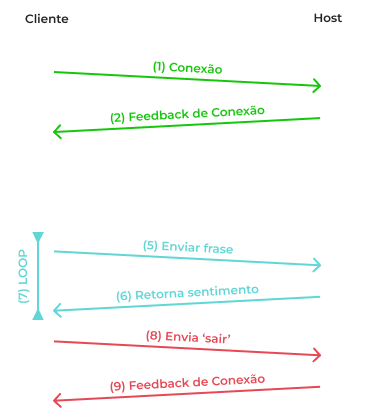
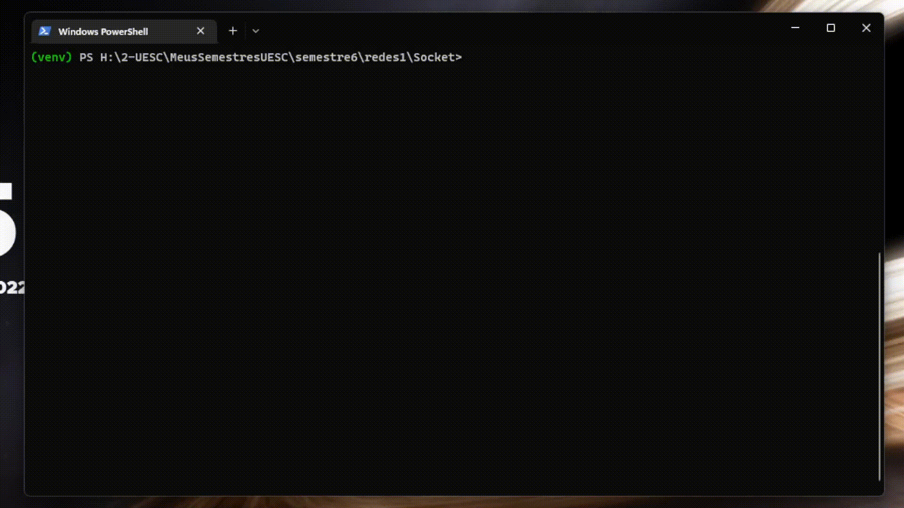

# Analisador de Emoções

## Discentes

-   [Igor Lima Rocha](https://github.com/igorroc)
-   [Isaac Nascimento Lima](https://github.com/inlima)
-   [João Victor Oliveira Rupp](https://github.com/jvrupp)

## Sobre o projeto

Este projeto consiste em uma análise de sentimento realizada sob algoritmos de Machine learning por intermédio de Sockets TCP, sendo que o usuário digita uma frase e o sistema interpreta qual o sentimento daquela frase diante de um conjunto de dados e atribui um sentimento em sua saída. O projeto foi desenvolvido em Python, utilizando a biblioteca NLTK (Natural Language Tool Kit) para a análise de sentimentos.

## Protocolo



1. Usuário se conecta ao Host e Porta, definida previamente nele (host)

2. Retorna um feedback de conexão

    1. Em caso de conexão positiva:

    Retorna o feedback positivo:

    <code style="color: #16C60C; background: #1a1d20; padding: 0.5em 1em">+ Conexão estabelecida com o servidor</code>

    A introdução ao sistema:

    ```
    Bem vindo(a) ao Analisador de Emoções!
    Para utilizar, basta digitar uma frase, e o servidor te responderá com o sentimento referente.
    Caso você deseje encerrar a conexão, basta digitar 'sair'
    ```

    E um a pergunta para saber o nome de usuário do cliente:

    ```
    Digite seu nome de usuário:
    ```

    2. Em caso negativo:

    Retorna apenas uma mensagem de feedback de conexão:

    <code style="color: #E74856; background: #1a1d20; padding: 0.5em 1em"> - Não foi possível se conectar ao servidor. Ele está ativo?</code>

3. Com a conexão feita de forma correta o cliente deve enviar seu nome para o host.

4. O host então envia a seguinte pergunta:

```
No que você está pensando, [nome_do_cliente]?
```

5. O usuário pode então digitar a sua frase e enviá-la para o servidor analisar o sentimento da mesma.

6. O servidor retorna uma palavra referente ao sentimento daquela frase antes digitada pelo cliente.

7. Os eventos 5 e 6 ficam em LOOP esperando novas interações do usuário, sendo estas interações, um novo texto ou um pedido de saída do sistema.

8. O cliente pode enviar um pedido de saída ao servidor, com o uso da exata palavra `sair`.

9. O servidor recebe esta mensagem, e desconecta o usuário da aplicação retornando a seguinte mensagem:

<code style="color: #E74856; background: #1a1d20; padding: 0.5em 1em"> - Conexão encerrada com o servidor</code>

### Visualização por parte do servidor


### Visualização por parte do cliente


Caso o cliente não consiga conectar:




## Como instalar

Antes de tudo, você precisa do **Python 3.8** instalado na sua máquina. Para isso, siga esse link: [https://www.python.org/downloads/release/python-380/](https://www.python.org/downloads/release/python-380/#:~:text=Files-,Version,-Operating%20System) e escolha a versão adequada para o seu sistema operacional.

Após isso, você precisa clonar o repositório para a sua máquina. Siga os comandos abaixo:

```bash
git clone https://github.com/igorroc/Socket.git

cd Socket
```

Daqui em diante, recomenda-se a utilização do **Power Shell** no Windows ou do **terminal nativo** no Linux.

Dentro da pasta do projeto, você precisa configurar o ambiente virtual. Para isso, execute o comando abaixo:

```bash
python -m venv venv
```

Após isso, você precisa ativar o ambiente virtual. Para isso, execute o comando abaixo :

```bash
# No Windows:
.\venv\Scripts\Activate.ps1

# No Linux:
source ./venv/bin/activate
```

E então, você pode instalar as dependências do projeto. Para isso, execute o comando abaixo:

```bash
pip install -r requirements.txt
```

## Erros

Caso você receba o erro abaixo:

```bash
File .\venv\Scripts\Activate.ps1 cannot be loaded because running scripts is disabled on this system. For more information, see about_Execution_Policies at https:/go.microsoft.com/fwlink/?LinkID=135170.
```

Execute o comando abaixo para resolver o problema:

```bash
Set-ExecutionPolicy -ExecutionPolicy Bypass -Scope Process -Force
```

E tente novamente.

## Como executar

Para executar o projeto, você precisa executar o arquivo **servidor.py** em um terminal e **client.py** em outro. Para isso, execute os comandos abaixo:

```bash

python ./server.py

python ./client.py

```
